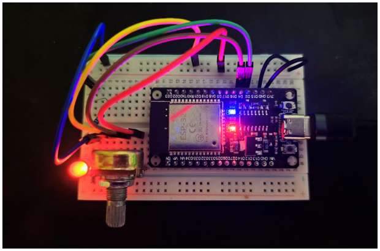

# PatroAutoController

[](https://opensource.org/licenses/MIT)

A robust ESP32-based Bluetooth (BLE) auto-controller with an adjustable press rate, built on FreeRTOS. Ideal for automating button presses in games and applications, such as holding the 'A' button in classic Game Boy titles.

---

## 🔹 About The Project

PatroAutoController transforms a standard ESP32 development board into a customizable, wireless auto-clicking joystick. The core functionality is to repeatedly press a specific gamepad button at a variable frequency, which is controlled in real-time by a physical potentiometer.

This project is built with a focus on software engineering best practices, featuring a modular and scalable codebase managed with PlatformIO, and a responsive, multi-tasking architecture powered by FreeRTOS.

### Key Features

- **Wireless Gamepad:** Connects to any compatible PC, Mac, or mobile device as a standard Bluetooth LE Gamepad.
- **Adjustable Frequency:** A potentiometer allows for precise, real-time control of the button press rate, from very slow to extremely fast.
- **Real-Time Performance:** Built on FreeRTOS, ensuring that reading user input (potentiometer) and performing the joystick action are handled by independent, non-blocking tasks.
- **Modular Codebase:** The code is cleanly separated into modules for hardware I/O, joystick control, and main application logic, making it easy to maintain and extend.
- **Visual Feedback:** An onboard LED provides a visual indication of every button press.

## ⚙️ Hardware Required

- ESP32 Development Board (any standard WROOM-32 model)
- 10kΩ Potentiometer
- 1x LED (any color)
- 1x 220Ω Resistor
- Protoboard and Jumper Wires

## 🔌 Circuit Diagram



Connect the components as follows:

| ESP32 Pin  | Component Connection                                                  |
| :--------- | :-------------------------------------------------------------------- |
| **3V3**    | Potentiometer - VCC Pin (Outer pin)                                   |
| **GND**    | Potentiometer - GND Pin (Other outer pin) & LED - Cathode (Short leg) |
| **GPIO 4** | Potentiometer - Signal Pin (Middle pin)                               |
| **GPIO 2** | 220Ω Resistor → LED - Anode (Long leg)                                |

## 🚀 Getting Started

This project is managed using Visual Studio Code with the PlatformIO extension.

### Prerequisites

- [Visual Studio Code](https://code.visualstudio.com/)
- [PlatformIO IDE Extension](https://platformio.org/install/ide?install=vscode)

### Installation

1.  **Clone the repository:**
    ```sh
    git clone https://github.com/luisfpatrocinio/esp32-PatroAutoController.git
    ```
2.  **Open the project in VS Code:**
    ```sh
    cd esp32-PatroAutoController
    code .
    ```
3.  **Build and Upload:**
    - Once PlatformIO has loaded, it will automatically detect the `platformio.ini` file and install all required library dependencies (`ESP32-BLE-Gamepad`, etc.).
    - Connect your ESP32 board via USB.
    - Click the "Upload" button (→ icon) in the PlatformIO status bar at the bottom of VS Code.

## 🕹️ How to Use

1.  Power on the programmed ESP32.
2.  On your computer or mobile device, open the Bluetooth settings and scan for new devices.
3.  Connect to the device named **"PatroAutoController"**.
4.  Open any game or a gamepad testing website (like [gamepad-tester.com](https://gamepad-tester.com/)).
5.  The device will automatically start pressing Button 2 ("B1" on most testers).
6.  Turn the potentiometer knob to adjust the press frequency.

## 📂 Project Structure

The project follows a clean, modular structure:

````
PatroAutoController/
├── include/
│   ├── config.h             # Centralized hardware and timing configuration
│   ├── HardwareIO.h         # Header for hardware abstraction layer
│   └── JoystickController.h # Header for BLE Gamepad logic
├── src/
│   ├── main.cpp             # Main application logic, FreeRTOS task creation
│   ├── HardwareIO.cpp       # Implementation for reading sensors and controlling LEDs
│   └── JoystickController.cpp # Implementation of the BLE Gamepad service
└── platformio.ini         # PlatformIO project configuration```
````

## ⚖️ License

Distributed under the MIT License. See `LICENSE` for more information.

## 📧 Contact

Luis Felipe Patrocinio - patrocinioluisf@gmail.com

Project Link: [https://github.com/luisfpatrocinio/esp32-PatroAutoController](https://github.com/luisfpatrocinio/esp32-PatroAutoController)
